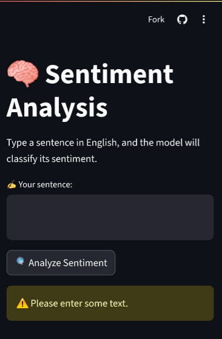
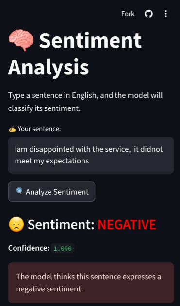

# Sentiment Analysis Web App

This web app allows users to analyze the sentiment of English sentences using a pre-trained Hugging Face Transformer model (`distilbert-base-uncased-finetuned-sst-2-english`). Built with Streamlit, the app provides an interactive interface and real-time predictions.

> ✅ Note: This project was developed and tested inside a Python virtual environment for clean dependency management.
<a href="https://your-app-link.com" target="_blank">
  <button style="background-color:#4CAF50;color:white;padding:10px 20px;border:none;border-radius:5px;cursor:pointer;">
    🚀 Open App
  </button>
</a>

## Features
- Classifies sentences as POSITIVE or NEGATIVE.
- Shows confidence scores for each prediction.
- Simple, interactive web interface.
- Ready for deployment on Streamlit Cloud or other platforms.

## Tech Stack
- Python
- Streamlit
- Hugging Face Transformers
- PyTorch

### Input

### Result

